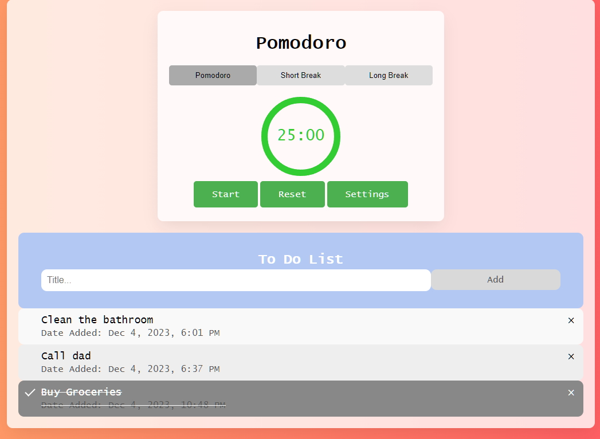

# Step by Step Instructions on running terminal
1. Check to see if you have Node.js installed:
    "node -v" in terminal
        If nothing shows, install node.js: https://nodejs.org/en
2. Check to see if Go is installed:
    "go version" in terminal
        If no version shows install Go: https://go.dev/dl/
3. Clone repo  
    "git clone https://github.com/leaalbano/ToDoList.git"
    go to directory that has package.json
    "npm install"
        This will get all the dependacies 
4. With all that installed, navigate to Backend directory in a terminal
    "go run main.go"
5. Now with another terminal
    Do "npm start" in directory where webpack.config.js file is located
6. localhost link should show, paste that link into browser


# How to run Go Server
  * install Go
  * in backend folder run 'go run main.go'
  * Now the backend can communicate with the server

# How to run todo list
  * install webpack
  * npm start within the directory where the webpack.config is


# Ports
  * Had to use github.com/rs/cors so that we can use two different ports on the same localMachine for the front and backend
  * Go server on port 8081
  * Webpack on 8080




# REST API
* Explanation: The REST API currently has 4 endpoints that do the following tasks:
  * Create Task
  * Get Task
  * Delete Task
  * Update Task

# First End-Point: Create Task
**POST:**
* Request Type: POST
```
URL: http://localhost:8081/createTask
JSON DATA: { "title":"Clean the bathroom", "status": "uncomplete" }
```
* Instructions: Send a POST Request to the "URL" with similar JSON Data, must contain a title to name the task, and a status such as "incomplete" or "inprogress"

# Second End-Point: Get Task
**GET:**
* Request Type: GET
```
URL: http://localhost:8081/getTasks
```
* Instructions: Send a GET request to the "URL" and it will return all created tasks in the following order. An JSON Array.

Returned Data: [{"id":"655d349bd0d52073c93b5524","title":"Clean the bathroom","status":"uncomplete","createdAt":"2023-11-21T22:52:11.641Z"},{"id":"655d3584d0d52073c93b5525","title":"Clean the garage","status":"uncomplete","createdAt":"2023-11-21T22:56:04.703Z"}]

# Third End-Point: Delete Task
**DELETE:**
* Request type: DELETE
```
curl -X DELETE "http://localhost:8081/deleteTask?id=TaskIDHere"
```
* Instructions: Deletes the Task based on the TaskID

# Fourth End-Point: Update Task
**UPDATE:** 
* Request type: PUT
```
curl -X PUT "http://localhost:8081/updateTask" \
     -H "Content-Type: application/json" \
     -d '{
         "id": "TaskIDHere",
         "title": "Updated Task Title",
         "status": "Updated Status"
         }
```
* Instructions: Updates the tasks based on the TaskID and what new title and status you want to put for the task

# Rest API Design


